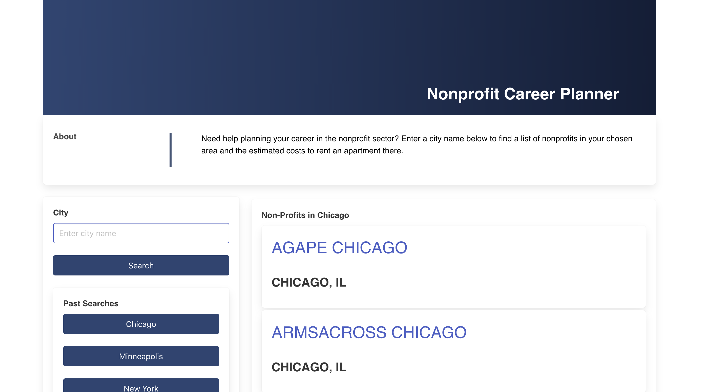

# Nonprofit-Career-Planner

## User Story

As a person looking to begin a career in the non-profit sector, I would like to know about career prospects in different parts of the country. I want to input a city and obtain a list of nonprofit organizations. In addition, to make an informed decision about where to work, I also want information about average rent.

## Live Application Link :
See live application [here](https://sthompsonchicago.github.io/Nonprofit-Career-Planner/)

## Built With : 

- [x] Vanilla JavaScript

- [x] Bulma CSS framework

- [x] ProPublica Nonprofit Explorer

- [x] API Realty Mole Rental Estimate API

